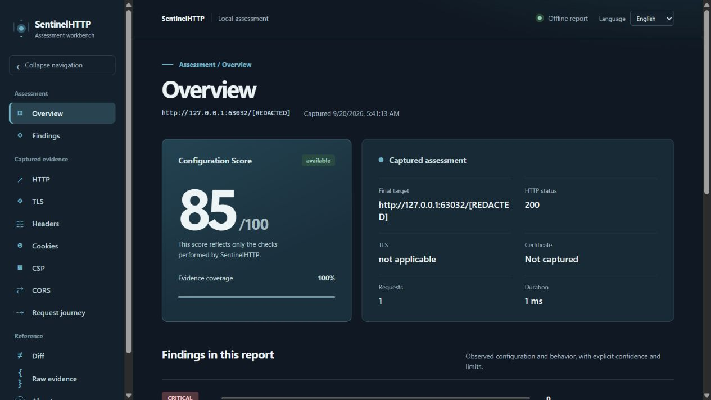
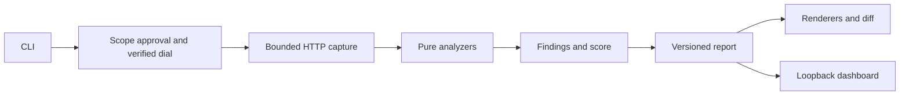

# SentinelHTTP

[English](README.md) · [Español](README.es.md) · [Русский](README.ru.md) · [简体中文](README.zh-CN.md)

SentinelHTTP is a local, bounded HTTP/HTTPS configuration assessment tool and
cybersecurity portfolio project. It captures one response by default, explains
the evidence behind conservative findings, computes a coverage-aware
Configuration Score, compares compatible reports and presents them in a local
dashboard. It does not claim exploitability or full-site security.

Use it only on systems you own or are authorized to assess.

## Quick start

Requirements: Go 1.26+ (CI uses 1.27.1). The checked-in dashboard assets work
without Node.js; rebuilding the frontend requires Node.js 24 and npm.
See [installation](docs/install.md) for platform details.

```console
go run ./cmd/sentinelhttp version
go run ./cmd/sentinelhttp scan http://127.0.0.1:8080/ --allow-private --format json --output report.json
go run ./cmd/sentinelhttp serve report.json
```

Run a local HTTP service on port 8080 for the example. The dashboard binds a
random `127.0.0.1` port and opens the browser; use `--no-open` in a terminal or
headless session. Existing output files are never overwritten.

On Windows, macOS and iOS, an HTTPS scan requires an explicit, current PEM CA
bundle through `--ca-file roots.pem`. This lets Go verify certificates without
native issuer retrieval outside the approved network boundary. A provided
bundle replaces system roots for that scan; TLS verification is never disabled.

```console
go run ./cmd/sentinelhttp scan https://your-authorized-host.example/ --ca-file roots.pem --format json --output before.json
go run ./cmd/sentinelhttp diff before.json after.json --format terminal
go run ./cmd/sentinelhttp scan http://127.0.0.1:8080/ --allow-private --trace-redirects --probe-cors --max-redirects 3 --max-requests 7
```

The last command is an explicit local lab run: four possible GETs plus three
uncredentialed CORS samples. Without those options, a scan makes one GET. All
requests pass through the same scope approval and verified dial. Private and
loopback targets are blocked unless `--allow-private` is present; that option
also restricts redirects to the original host. A traced HTTPS-to-HTTP downgrade
is blocked. No crawling, login, cookie jar or credentialed probing is present.

## What the report says

The versioned JSON document records bounded HTTP, TLS, security-header,
cookie, CSP, CORS and redirect evidence. Findings state the observation,
inference, confidence, limitations and static references. The score covers
only one captured primary response and shows assessed and unavailable domains.
An incomplete scan or missing evidence cannot become a clean bill of health.

Paths, queries, response bodies, cookie values and raw `Location` values are
excluded from the report. Origin, certificate and cookie-name metadata can
still be sensitive: protect report files. The diff compares only compatible
queryless-root scans of the same origin and labels uncertain changes as
`unknown`. The dashboard reads validated local files; a report is not proof of
its own authenticity. [Report contract](docs/reporting.md) ·
[Scoring](docs/scoring.md) · [Diff](docs/diff.md) ·
[Dashboard](docs/dashboard.md).

## Dashboard preview



The [screenshot gallery](docs/screenshots.md) also shows finding details and
the before/after diff. All captures use local synthetic fixtures.

## Architecture and verification



`network` owns outbound scan sockets; `dashboard` owns the sole inbound
loopback listener. The analyzers, finding engine, scoring, reporting and diff
engine do not open network connections. See the
[architecture](docs/architecture.md), [self-review](docs/architecture-self-review.md)
and [security model](docs/security.md).

```console
go test ./cmd/... ./internal/... ./tools/...
go vet ./cmd/... ./internal/... ./tools/...
npm ci --prefix frontend
npm run lint --prefix frontend
npm run build --prefix frontend
```

The tests use fake resolvers/dialers and local HTTP/TLS fixtures, not public
targets. Linux CI runs the Go race detector and online dependency audits;
the local Windows workstation used during development lacks a C compiler for
`go test -race`. Frontend output is bundled in the Go binary and uses no CDN.
Human presentation supports English, Spanish, Russian and Simplified Chinese;
use `--lang es|ru|zh-CN` for CLI output. JSON remains language-neutral.

For CLI limits and exit codes, see [CLI](docs/cli.md). For development and
testing, see [development](docs/development.md). For the design rationale and
portfolio case study, see [project story](docs/portfolio.md). The
[v0.1.0 release notes](docs/release-notes-v0.1.0.md) and
[release evidence](docs/release-readiness.md) record the completed gates.
The [interview review](docs/interview-review.md) explains the main design
decisions and limits.

## License

No open-source license has been selected for v0.1.0. The public source may be
read and reviewed; reuse requires the author's permission.
