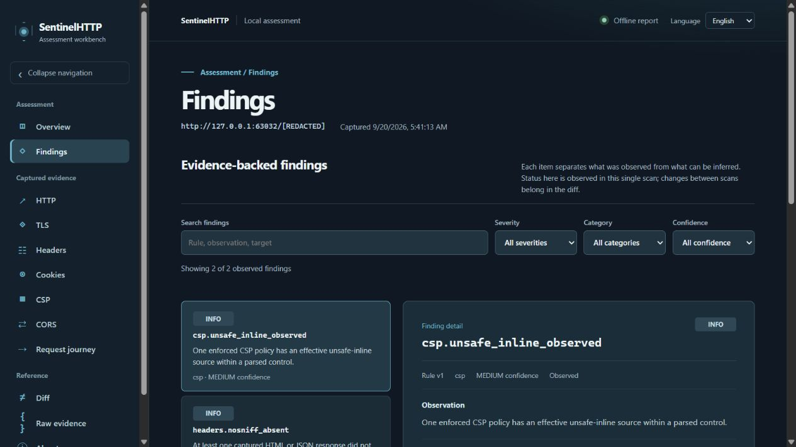
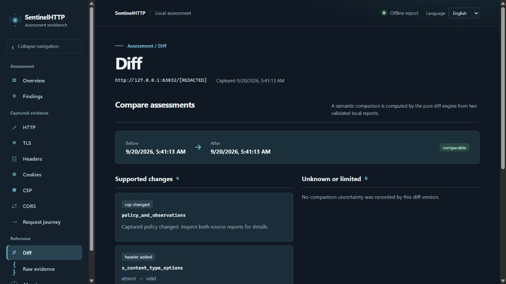

# Dashboard screenshots

These captures use local, synthetic report fixtures. The targets shown are
loopback addresses; no public target was scanned or exposed in the images.
They illustrate presentation, not a security verdict.

## Overview

## Findings

## Diff

The [dashboard guide](dashboard.md) explains the local server and its security
boundary. The [report contract](reporting.md) explains how these views use
validated, minimized JSON evidence.
